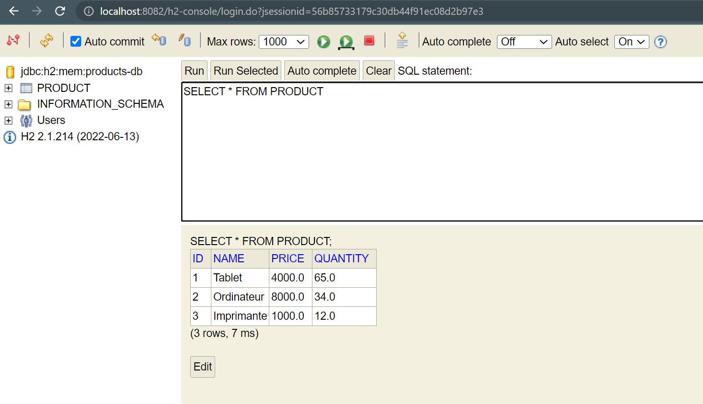
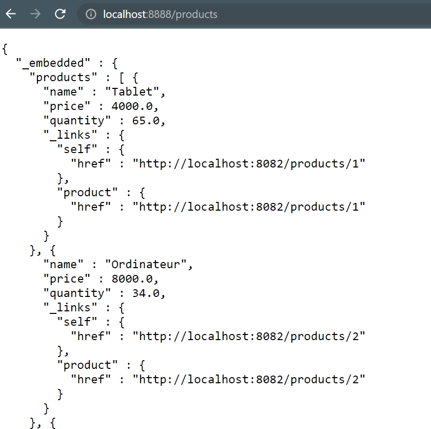
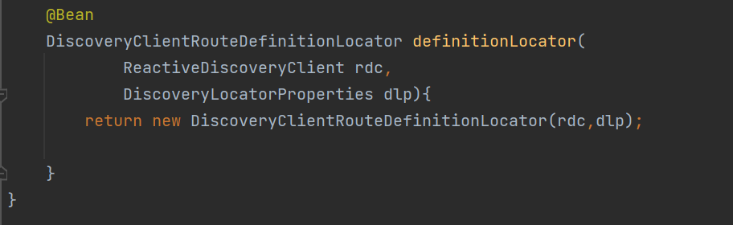
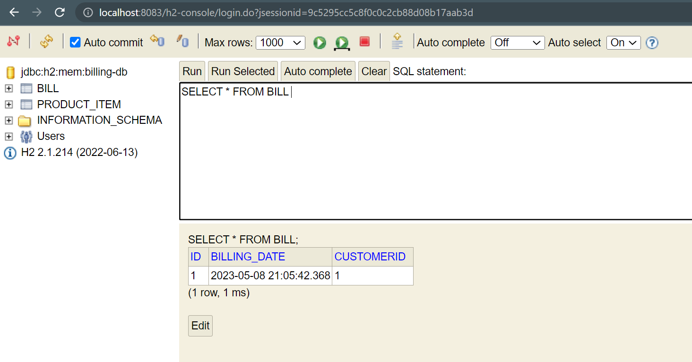

# Programmation-Distrubiees-Middlewares

Travail à faire : 
1. Créer le micro service   • Customer-service  • Créer l’entité Customer  • Créer l’interface CustomerRepository basée sur Spring Data  • Déployer l’API Restful du micro-service en utilisant Spring Data Rest  • Tester le Micro service  
2. Créer le micro service Inventory-service  • Créer l’entité Product  • Créer l’interface ProductRepository basée sur Spring Data  • Déployer l’API Restful du micro-service en utilisant Spring Data Rest  • Tester le Micro service  
3. Créer la Gateway service en utilisant Spring Cloud Gateway  
4. Tester la Service proxy en utilisant une configuration Statique basée
sur le fichier application.yml  
5. Tester la Service proxy en utilisant une configuration Statique basée
une configuration Java  
6. Créer l’annuaire Registry Service basé sur NetFlix Eureka Server  
7. Tester le proxy en utilisant une configuration dynamique de Gestion des
routes vers les micro services enregistrés dans l’annuaire Eureka Server  
8. Créer Le service Billing-Service en utilisant Open Feign pour
communiquer avec les services Customer-service et Inventory-service  
9. Créer un client Angular qui permet d’afficher une facture  

<h3>1. Créer le micro service</h3>  
<h3>Tester la couche DAO</h3> 
 
<h3>Tester la couche DAO</h3> 
 
<h3>Créer le Web service Restfull qui permet de gérer des comptes</h3> 
<h3>Tester le web micro-service Rest </h3> 

 

 
<h3></h3> 
 
<h3></h3> 
 
<h3> Générer et tester Actuator </h3> 
 
<h3></h3> 
 
<h3></h3> 
 
 
<h3></h3> 
<h3>Tester la couche Dao Customers service</h3> 

 
<h3></h3> 
<h3>Tester la couche Dao Inventory service</h3> 

 
 
<h3></h3> 
 
<h3></h3> 
<h3>Tester le service d'enregistrement Eureka </h3> 

 
 
 
 
 
 
 
<h3> Tester le service Billing </h3> 
 
 

