# Programmation-Distrubiees-Middlewares

Travail à faire : 
1. Créer un projet Spring Boot avec les dépendances Web, Spring Data JPA, H2, Lombok  
2. Créer l'entité JPA Compte  
3. Créer l'interface CompteRepository basée sur Spring Data   
4. Tester la couche DAO  
5. Créer le Web service Restfull qui permet de gérer des comptes  
6. Tester le web micro-service en utilisant un client REST comme Postman  
7. Générer et tester la documentation Swagger de des API Rest du Web service  
8. Exposer une API Restful en utilisant Spring Data Rest en exploitant des projections  
9. Créer les DTOs et Mappers  
10. Créer la couche Service (métier) et du micro service  
11. Créer un Web service GraphQL pour ce micro-service  

<h3>1. Créer un projet Spring Boot avec les dépendances Web, Spring Data JPA, H2, Lombok</h3>  
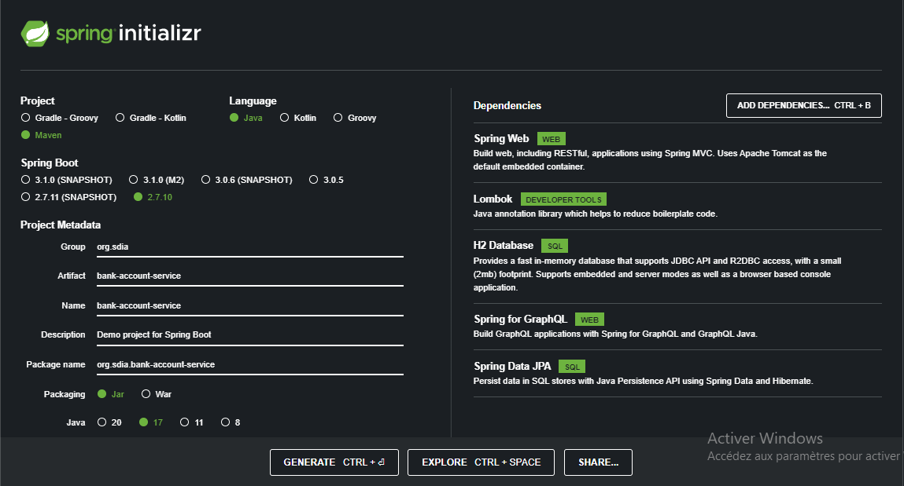 
<h3>Tester la couche DAO</h3> 
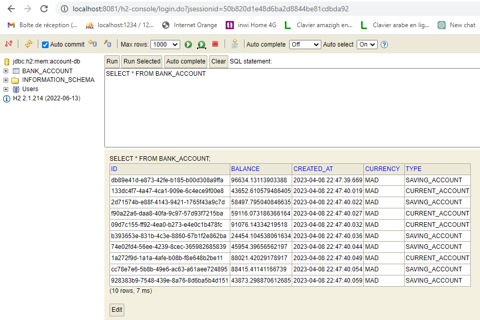 
<h3>Créer le Web service Restfull qui permet de gérer des comptes</h3> 
<h3>Tester le web micro-service en utilisant Postman </h3> 

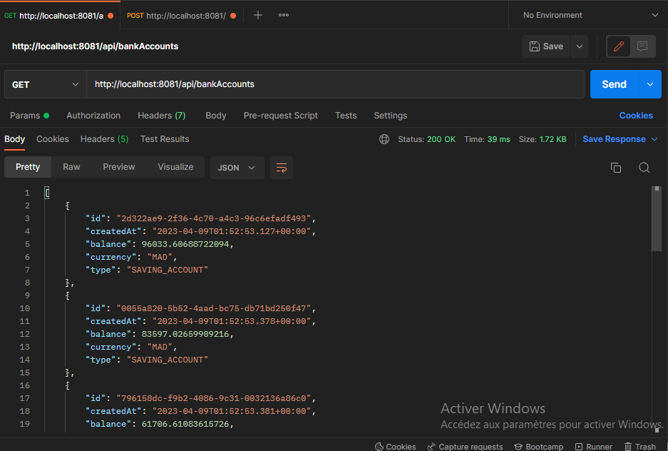 

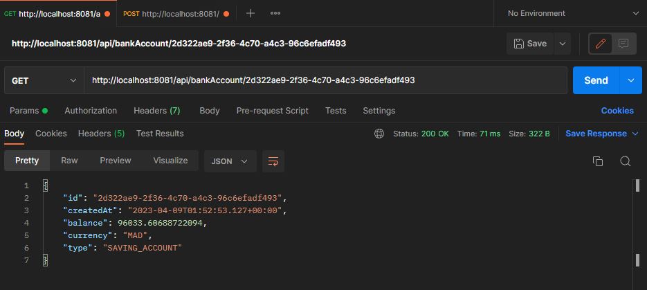 
<h3></h3> 
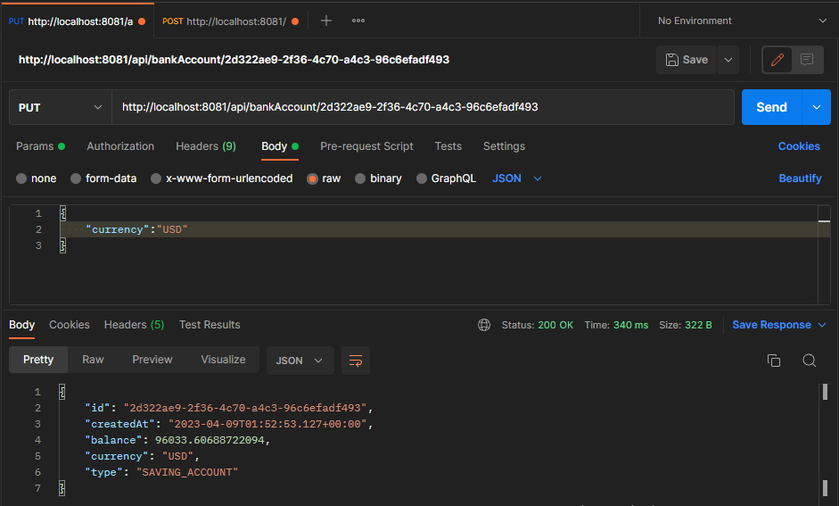 
<h3></h3> 
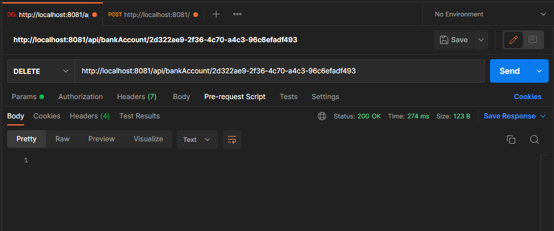 
<h3> Générer et tester la documentation Swagger de des API Rest du Web service </h3> 
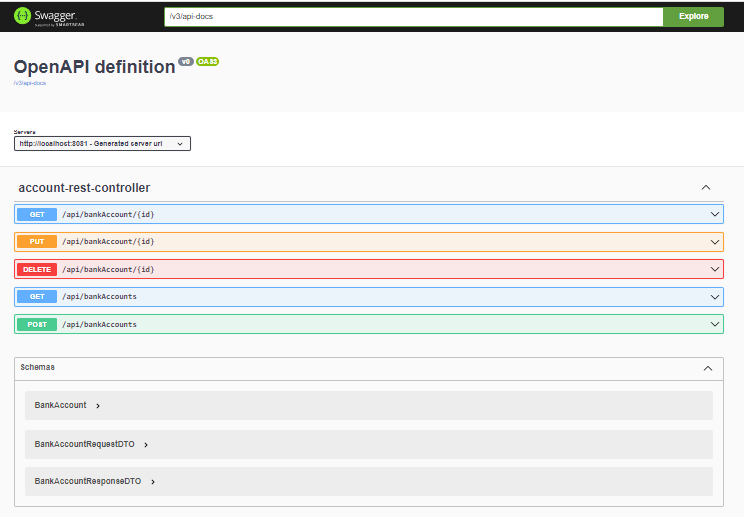 
<h3></h3> 
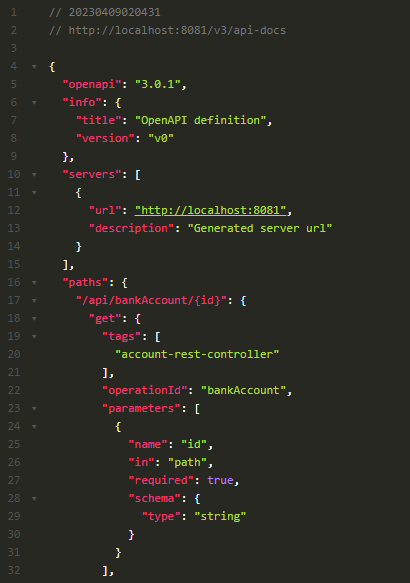 
<h3></h3> 
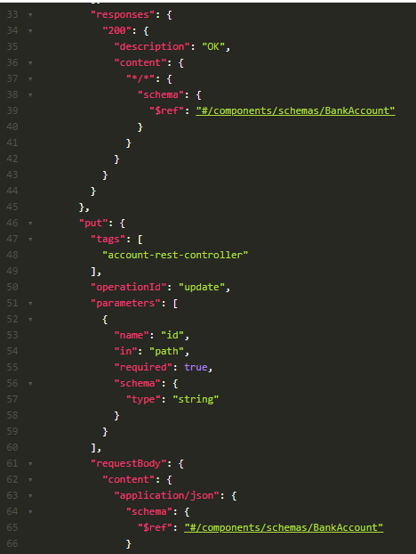 
<h3>Exposer une API Restful en utilisant Spring Data Rest en exploitant des projections</h3> 
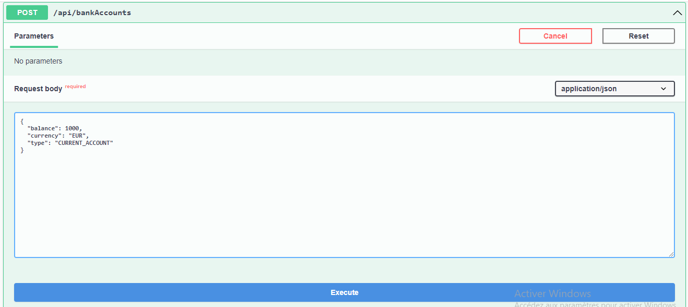 
<h3></h3> 
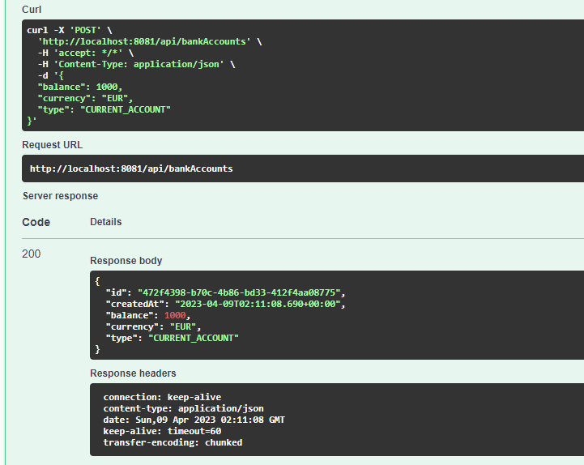 
<h3></h3> 
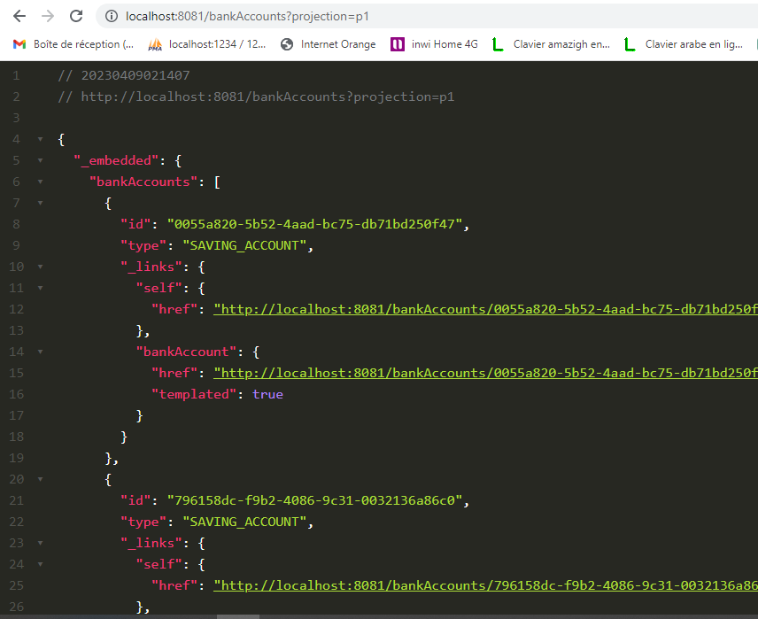 
<h3>Tester la couche DAO et le web service GraphQL</h3> 
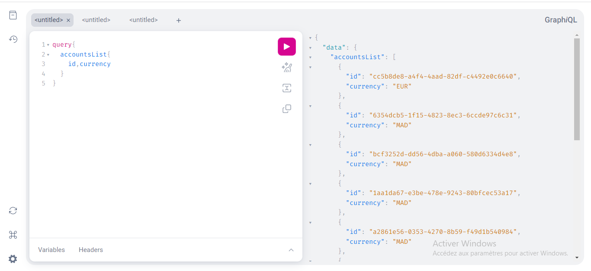 
<h3></h3> 
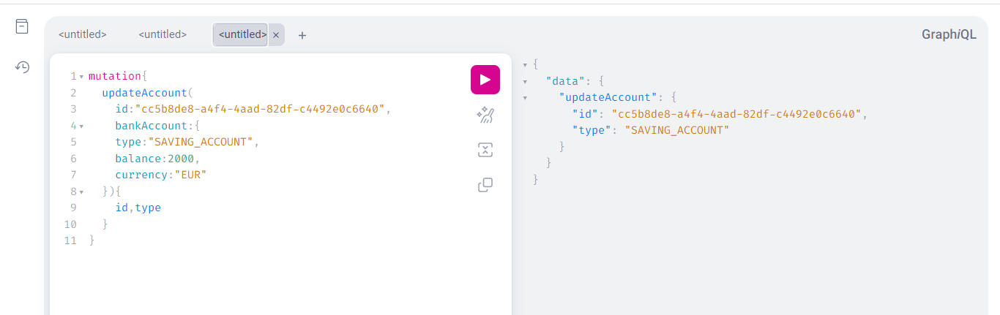 
<h3></h3> 
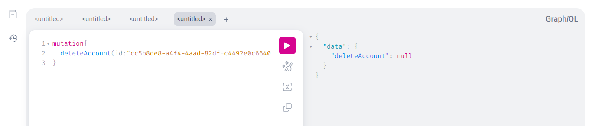 
<h3></h3> 

