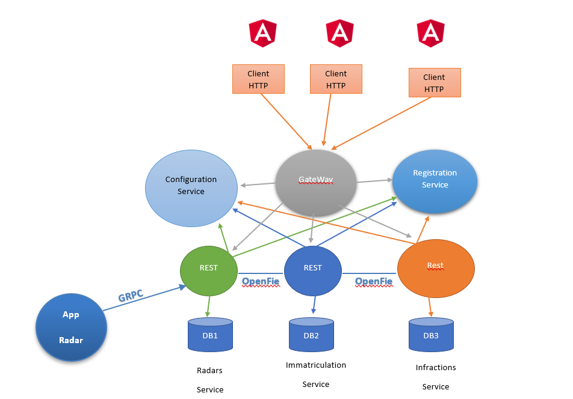

# Projet Systèmes Distribués

On souhaite créer un système distribué basé sur les micro-services Cette application devrait
permettre de gérer et d’automatiser le processus des infractions concernant des véhicules
suites à des dépassement de vitesses détectés par des radars automatiques. Le système se
compose de trois micro-services :  
• Le micro-service qui permet de gérer les radars. Chaque radar est défini par son id, sa
vitesse maximale, des coordonnées : Longitude et Latitude. 
• Le micro-service d’immatriculation qui permet de gérer des véhicules appartenant des
propriétaires. Chaque véhicule appartient à un seul propriétaire. Un propriétaire est
défini par son id, son nom, sa date de naissance, son email et son email. Un véhicule
est défini par son id, son numéro de matricule, sa marque, sa puissance fiscale et son
modèle.  
• Le micro-service qui permet de gérer les infractions. Chaque infraction est définie par
son id, sa date, le numéro du radar qui a détecté le dépassement, le matricule du
véhicule, la vitesse du véhicule, la vitesse maximale du radar et le montant de
l’infraction.  
En plus des opérations classiques de consultation et de modifications de données, le système
doit permettre de poster un dépassement de vitesse qui va se traduire par une infraction. En
plus, il doit permettre à un propriétaire de consulter ses infractions.

 

## Architechure technique

## Architecture des fichiers

- **radars-angular-frontend** : contient la partier frontend developpée avec angular
- **immatriculation-service** : Microservice de matruculation et vehicule - proprietaire.
- **radar-service** : Microservice de radar.
- **infraction-service** : Microservice d'établissement des infractions et amendes.

## Diagramme de classe

## Testing

### Afficher les vehicules et leur proprietaires

### Afficher les proprietaies

### Afficher les proprietaies avec Postman

### Afficher les vehicules avec Postman

### Tester SOAP

### Tester GRAPHQL

### Tester GRPC

### Tester l'infraction avec REST

### Tester Radars avec REST

### Tester Eureka Discovery

### Linterface Proprietaires avec angular

### Linterface Vehicules avec angular

### Linterface Radars avec angular

