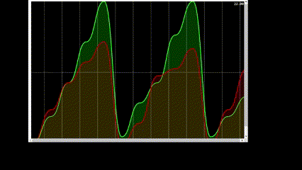

# Programmation-Distrubiees-Middlewares
<<<<<<< HEAD

 
=======

>>>>>>> c9793eaadec7644cc05c1690ccc8a8629aac7368

Travail effectué : 
1.  
- Télécharger Kafka (voir <a href="https://kafka.apache.org/downloads">ici</a> ) 
- Démarrer Zookeeper 
- Démarrer Kafka-server 
- Tester avec Kafka-console-producer et kafka-console-consumer 
2. Avec Docker (voir <a href=" https://developer.confluent.io/quickstart/kafka-docker">ici</a>) 
 -pour plus d'information (voir <a href="https://www.youtube.com/watch?v=9O1Kuk2xXO8" >ici</a>) 
 - Créer le fichier docker-compose.yml 
 - Démarrer les conteneurs docker : zookeeper et kafka-broker 
 - Tester avec Kafka-console-producer et kafka-console-consumer 
3.  
En utilisant KAFKA et Stspring Cloud Streams, nous souhaiterons créer : 
- Un Service Producer KAFKA via un Rest Controler 
- Un Service Consumer KAFKA 
- Un Service Supplier KAFKA 
- Un Service de Data Analytics Real Time Stream Processing avec Kaflka Streams 
- Une application Web qui permet d'afficher les résultats du Stream Data Analytics en temps réel 

<h3>1. Lancer le serveur Zookeeper:</h3>  

	 > bin\windows\zookeeper-server-start.bat config/zookeeper.properties
<h3>2. Lancer le Broker KAFKA :</h3> 

     > bin\windows\kafka-server-start.bat config/server.properties
<h3>3. Lancer Kafka-console-consumer :</h3> 

     > bin\windows\kafka-console-consumer.bat --bootstrap-server localhost:9092
        --topic R4 --property print.key=true --property print.value=true
            --property key.deserializer=org.apache.kafka.common.serialization.StringDeserializer 
        --property value.deserializer=org.apache.kafka.common.serialization.StringDeserializer
<h3>4. Lancer kafka-console-producer :</h3> 

     > bin\windows\kafka-console-producer.bat --broker-list localhost:9092 --topic R4
<h3>==================  Docker ====================</h3> 

Lancer docker:

	 > docker-compose up -d

     > docker exec --interactive --tty broker kafka-console-consumer --bootstrap-server broker:9092 --topic R2

     > docker exec --interactive --tty broker kafka-console-producer --bootstrap-server broker:9092 --topic R2

     > docker exec --interactive --tty broker kafka-console-consumer --bootstrap-server broker:9092 --topic R66 
        --property print.key=true --property print.value=true --property key.deserializer=org.apache.kafka.common.serialization.StringDeserializer 
        --property value.deserializer=org.apache.kafka.common.serialization.LongDeserializer

     > docker exec --interactive --tty broker kafka-topics --bootstrap-server broker:9092 --list

